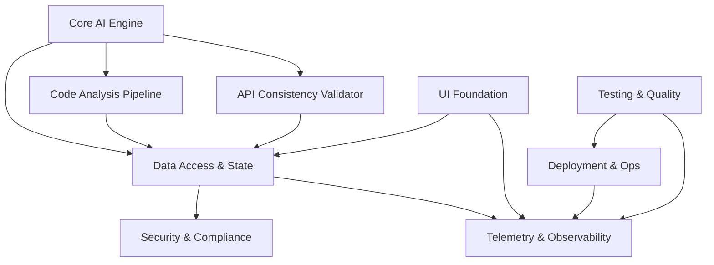

# 서비스별 상세 PRD 문서 목록

## 📋 완성된 PRD 문서

### 핵심 서비스 (Core Services)

1. **[Core AI Engine](./core-ai-engine-detailed.md)**
   - 컨텍스트 빌더 시스템
   - 프롬프트 오케스트레이션
   - AI 모델 통합 및 추론
   - 응답 처리 및 랭킹

2. **[Code Analysis Pipeline](./code-analysis-pipeline-detailed.md)**
   - 다중 언어 AST 파싱
   - 증분 파싱 및 델타 생성
   - 심볼 그래프 구축
   - 의존성 분석

3. **[API Consistency Validator](./api-consistency-validator-detailed.md)**
   - API 스키마 분석
   - 일관성 검증
   - 브레이킹 체인지 감지
   - 실시간 모니터링

### 데이터 및 상태 관리

4. **[Data Access & State Management](./data-access-state-management-detailed.md)**
   - 글로벌 상태 관리
   - 데이터 페칭 계층
   - 캐싱 전략
   - 실시간 동기화

### 보안 및 규정 준수

5. **[Security & Compliance](./security-compliance-detailed.md)**
   - PII 데이터 보호
   - 인증 및 인가
   - 암호화 서비스
   - 감사 로깅

### 모니터링 및 관측성

6. **[Telemetry & Observability](./telemetry-observability-detailed.md)**
   - 메트릭 수집 시스템
   - 분산 추적
   - 로그 수집 및 분석
   - 실시간 대시보드

### UI 및 사용자 경험

7. **[UI Foundation & Component System](./ui-foundation-component-system-detailed.md)**
   - 디자인 토큰 시스템
   - 컴포넌트 라이브러리
   - 레이아웃 시스템
   - 접근성 지원

### 인프라 및 운영

8. **[Deployment & Operations](./deployment-operations-detailed.md)**
   - CI/CD 파이프라인
   - Infrastructure as Code
   - 컨테이너 오케스트레이션
   - 자동 스케일링

### 품질 관리

9. **[Testing & Quality](./testing-quality-detailed.md)**
   - 테스트 프레임워크
   - E2E 테스트
   - 성능 테스트
   - 품질 게이트

## 🎯 각 PRD 문서 구조

모든 PRD 문서는 다음과 같은 일관된 구조를 따릅니다:

1. **개요**
   - 목적
   - 핵심 목표
   - 범위

2. **기능 요구사항**
   - 상세 기능 명세
   - 인터페이스 정의
   - 데이터 모델

3. **비기능 요구사항**
   - 성능 요구사항
   - 확장성
   - 신뢰성

4. **기술 구현**
   - 아키텍처
   - 핵심 컴포넌트
   - 통합 포인트

5. **테스트 전략**
   - 단위 테스트
   - 통합 테스트
   - 성능 테스트

## 📊 서비스 간 의존성

## 🚀 구현 우선순위

### Phase 1 (필수)
- Core AI Engine
- Code Analysis Pipeline
- Data Access & State Management
- Security & Compliance (기본)
- UI Foundation (기본)

### Phase 2 (확장)
- API Consistency Validator
- Telemetry & Observability
- Testing & Quality (자동화)
- Deployment & Operations

### Phase 3 (고급)
- Security & Compliance (고급)
- UI Foundation (고급)
- Performance Optimization
- Multi-language Support

## 📈 성공 지표

### 기술적 지표
- 응답 시간: P95 < 500ms
- 가용성: > 99.9%
- 테스트 커버리지: > 70%
- 보안 취약점: 0 (Critical)

### 비즈니스 지표
- 코드 제안 수락률: > 30%
- 사용자 만족도: > 4.5/5
- 일일 활성 사용자: > 1000
- 버그 발견 시간: < 24시간

## 🔄 업데이트 이력

- **2025-09-25**: 초기 PRD 문서 세트 완성
  - 9개 핵심 서비스 PRD 작성
  - 상세 기술 명세 포함
  - 코드 예시 및 구현 가이드 제공

## 📞 문의

PRD 관련 문의사항은 다음 채널을 통해 연락 주세요:
- Slack: #ai-pair-programmer-prd
- Email: prd-team@aipairprogrammer.dev
- GitHub Issues: [프로젝트 이슈](https://github.com/your-org/ai-pair-programmer/issues)
